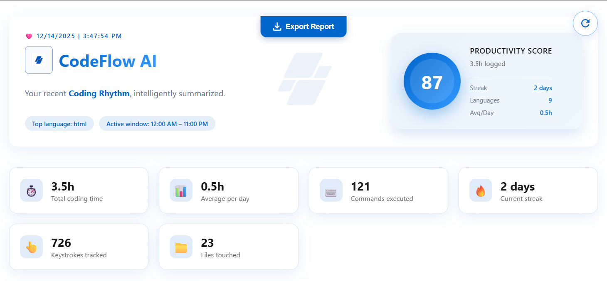
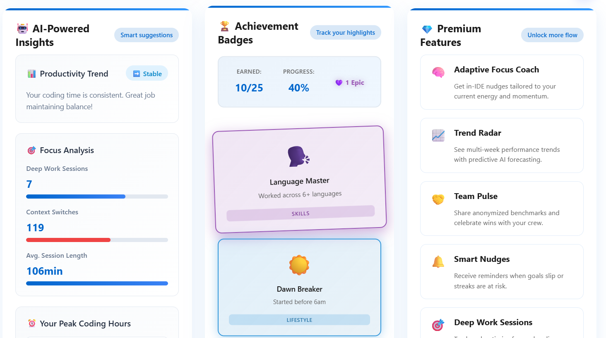
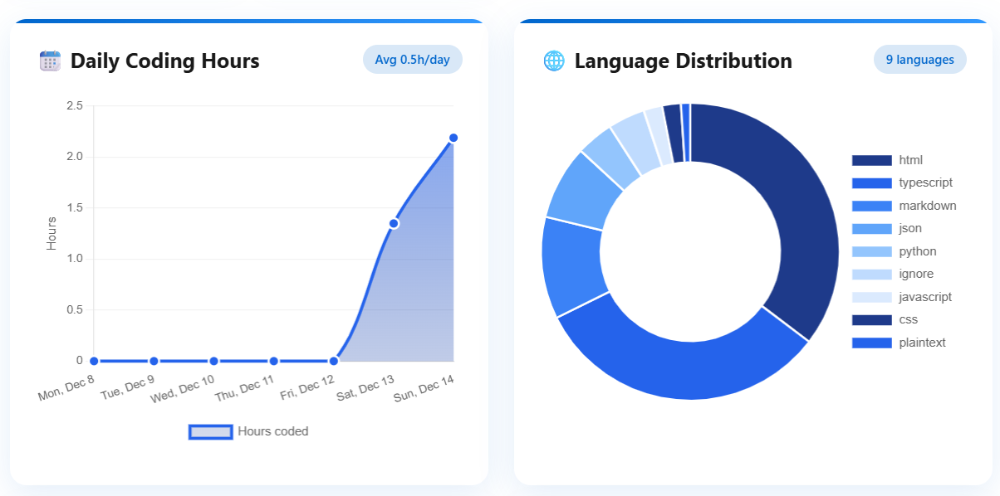
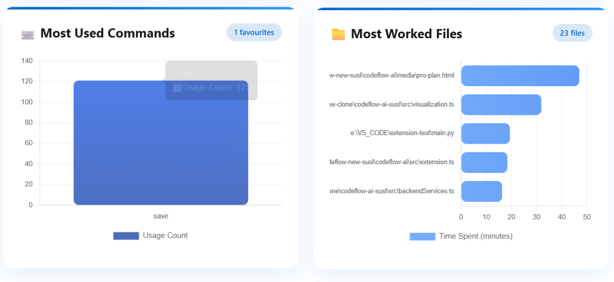

<div align="center">


# CodeFlow AI

### ✨ AI-Powered Productivity Tracker for Developers ✨

Transform your coding habits with intelligent insights, personalized recommendations, and gamified achievements!

[🎯 Features](#-features) • [📦 Installation](#-installation) • [⚙️ Configuration](#️-configuration) • [🎮 Usage](#-usage) • [🏆 Gamification](#-gamification)

---

</div>

## 🎮 Usage

### 📊 Available Commands

Open Command Palette (`Ctrl+Shift+P` or `Cmd+Shift+P`) and type:

```
🔷 CodeFlow: Show Weekly Report
   └─ Display comprehensive productivity analytics with charts

🔶 CodeFlow: Train TensorFlow.js Model
   └─ Train local ML model for productivity predictions

🔷 CodeFlow: Test Gemini AI Connection
   └─ Verify Google Gemini AI integration

🔶 CodeFlow: Reset Extension to Fresh State
   └─ Clear all data and reset to initial state (cannot be undone)
```

### 📈 Weekly Report Features

The weekly report includes:

- 📊 **Coding Time Overview** - Total hours by day
- 💻 **Language Distribution** - Time spent per language
- 📁 **Most Active Files** - Frequently edited files
- 🎯 **Command Usage Stats** - Top VS Code commands
- 📈 **Productivity Trends** - Week-over-week comparison
- 💡 **AI Recommendations** - Personalized suggestions
- 🏆 **Achievement Summary** - New badges earned

## 🎨 Screenshots

### 📊 Weekly Report Dashboard
> View your productivity metrics at a glance




### 🏆 Achievement Badges
> Unlock badges as you code




### 📈 Activity Visualization
> Beautiful charts and analytics



---




## 🎯 Features

<table>
<tr>
<td width="50%">

### 📊 **Activity Tracking**
- ⌨️ **Keystroke Monitoring** - Track your typing patterns
- 🎯 **Command Usage** - Monitor VS Code command frequency
- 📁 **File Interactions** - Analyze file access patterns
- ⏱️ **Time Tracking** - Measure coding session duration
- 🔍 **Language Detection** - Identify programming languages used

</td>
<td width="50%">

### 🧠 **AI-Powered Insights**
- 📈 **Productivity Reports** - Weekly performance analysis
- 💡 **Smart Suggestions** - Personalized improvement tips
- 📉 **Trend Analysis** - Identify productivity patterns
- 🎨 **Visual Analytics** - Beautiful charts and graphs
- 🤖 **Machine Learning** - Local TensorFlow.js predictions

</td>
</tr>
<tr>
<td width="50%">

### 🎮 **Gamification System**
- 🏅 **Achievement Badges** - Unlock coding milestones
- ⭐ **Points & Rewards** - Earn points for activities
- 📊 **Leaderboards** - Compare with team members
- 🎯 **Challenges** - Complete daily/weekly goals
- 🔥 **Streaks** - Maintain coding consistency

</td>
<td width="50%">

### 🔐 **Privacy & Security**
- 🏠 **Local Processing** - Data stays on your machine
- 🔒 **Encrypted Storage** - Secure data management
- 🌐 **Optional Cloud Sync** - Team insights (opt-in)
- 🔌 **External API Support** - Use your own AI services
- ⚙️ **Full Control** - Customize what's tracked
- 🔄 **Reset Capability** - Fresh start anytime with one command

</td>
</tr>
</table>


## ⚙️ Configuration

### 🎛️ Extension Settings

Access settings via `File > Preferences > Settings` and search for "CodeFlow"

| Setting | Description | Default | Icon |
|---------|-------------|---------|------|
| `codeflow.enabled` | Enable/disable activity tracking | ✅ `true` | 🔄 |
| `codeflow.cloudSync` | Sync data to cloud for team insights | ❌ `false` | ☁️ |
| `codeflow.useExternalAPI` | Use external AI API for analysis | ❌ `false` | 🔌 |
| `codeflow.apiEndpoint` | Custom AI API endpoint URL | `""` | 🌐 |
| `codeflow.apiKey` | Authentication key for external API | `""` | 🔑 |
| `codeflow.trackingInterval` | Data collection interval (minutes) | `5` | ⏱️ |
| `codeflow.showNotifications` | Display achievement notifications | ✅ `true` | 🔔 |

### 📝 Example Configuration

```json
{
  "codeflow.enabled": true,
  "codeflow.cloudSync": false,
  "codeflow.useExternalAPI": false,
  "codeflow.trackingInterval": 5,
  "codeflow.showNotifications": true
}
```
---

## 🏆 Gamification

### 🏅 Badge Categories

<table>
<tr>
<td align="center" width="25%">

#### 🌟 **Beginner**


- 🎯 First Commit
- 📝 100 Lines
- ⏱️ 1 Hour Coding

</td>
<td align="center" width="25%">

#### ⚡ **Intermediate**


- 💪 1K Lines
- 🔥 7 Day Streak
- 🎨 5 Languages

</td>
<td align="center" width="25%">

#### 🚀 **Advanced**


- 🌟 10K Lines
- ⚡ 30 Day Streak
- 🏆 50 Commits

</td>
<td align="center" width="25%">

#### 👑 **Master**


- 💎 100K Lines
- 🔥 100 Day Streak
- 🎯 Perfect Week

</td>
</tr>
</table>

### 🎯 Achievement System

Unlock badges by:
- ✍️ Writing code consistently
- 🎯 Completing daily challenges
- 🔥 Maintaining coding streaks
- 📚 Learning new languages
- 🤝 Collaborating with teams

---

## 🛠️ Technology Stack

<div align="center">


</div>

---

## 🔒 Privacy & Data

### 🏠 Local-First Approach

- ✅ All data processed on your machine
- ✅ No telemetry sent without consent
- ✅ Full data ownership and control
- ✅ Export/delete data anytime

### ☁️ Optional Cloud Sync

When enabled:
- 🔐 End-to-end encryption
- 🌐 Team insights and leaderboards
- 📊 Cross-device synchronization
- 🔑 Secure authentication

---

## 🚀 Roadmap

- [ ] 🎯 **Custom Goals** - Set personal productivity targets
- [ ] 📱 **Mobile App** - View reports on mobile devices
- [ ] 🤖 **Advanced AI** - GPT-powered code suggestions
- [ ] 🌍 **Team Analytics** - Organization-wide insights
- [ ] 🔌 **IDE Integration** - Support for IntelliJ, Sublime
- [ ] 🎨 **Custom Themes** - Personalize report appearance
- [ ] 📊 **Export Formats** - PDF, CSV, Excel reports
- [ ] 🔔 **Smart Notifications** - Break reminders, goal alerts

---

## 🤝 Contributing

We welcome contributions! 🎉

1. 🍴 Fork the repository
2. 🌿 Create a feature branch (`git checkout -b feature/amazing`)
3. 💾 Commit your changes (`git commit -m 'Add amazing feature'`)
4. 📤 Push to the branch (`git push origin feature/amazing`)
5. 🎯 Open a Pull Request

---

## 📄 License

MIT License - see [LICENSE](LICENSE) file for details

---

## 📞 Support

Need help? We're here for you! 💬

- 📧 **Email**: support@codeflow-ai.com
- 🐛 **Issues**: [GitHub Issues](https://github.com/CodeFlow-SUSL/codeflow-ai-susl/issues)
- 💬 **Discussions**: [GitHub Discussions](https://github.com/CodeFlow-SUSL/codeflow-ai-susl/discussions)
- 📖 **Documentation**: [Wiki](https://github.com/CodeFlow-SUSL/codeflow-ai-susl/wiki)

---

## 🌟 Release Notes

### 🎉 Version 0.1.4 (Latest)

**New Features:**
- ✨ **Reset Extension Command** - Fresh start with one click
  - Clears all tracked activity data
  - Removes badges and progress
  - Deletes authentication tokens
  - Returns extension to initial state
- 🤖 **Google Gemini AI Integration** - Test connection command
- 🧠 **TensorFlow.js Training** - Train local ML models

**Features:**
- ✨ Activity tracking and analytics
- 📊 Weekly productivity reports
- 🧠 AI-powered insights (Gemini + TensorFlow.js)
- 🎮 Gamification system with badges
- 🔐 Privacy-first local processing
- 🏆 Achievement tracking
- 📈 Beautiful data visualizations

**Previous Releases:**
- 🎯 Version 0.0.1 - Initial release with core features

---

<div align="center">

### ⭐ Star Us on GitHub!

If you find CodeFlow AI helpful, please consider giving us a star! ⭐

Made with ❤️ by the CodeFlow Team


**[⬆ Back to Top](#-codeflow-ai)**

</div>